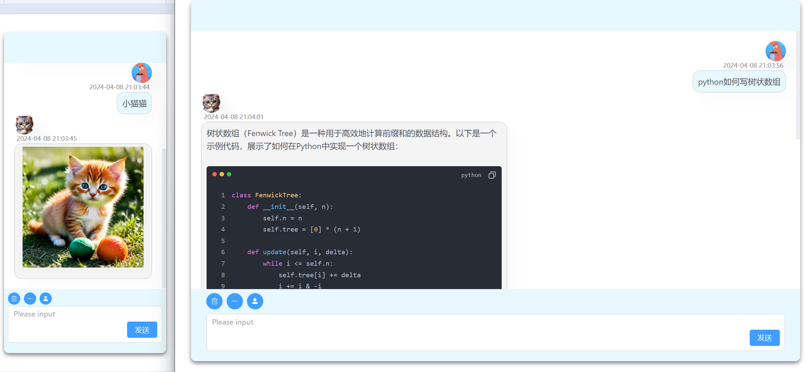

# ChatGPT-Fast-Web

##### This article was automatically generated by chatgpt

> [Project demo](https://107.151.246.180)
> You may enter your own key or try the server's built-in key. The server is relatively slow and it takes a few seconds to respond after input, which is not indicative of the response speed when deployed locally.

> Deploy your own personal ChatGPT web application locally, supporting GPT3 and GPT4 models.
> No backend server required, lightweight, and responsive.



## Features

- Multi-model selection (GPT3, GPT4)
- Extremely fast response speed, supports streaming responses
- Markdown syntax support, including code highlighting and copying
- Context connection and deletion support
- Role (mask) feature, referenced project: [NextChat](https://github.com/ChatGPTNextWeb/ChatGPT-Next-Web)

## Update Log

<details open>
<summary><b>Year 2024</b></summary>
	
Date   |  Update
------- | :-------
04/11 | Added message list, multiple conversation options.
04/09  | Added the front-end configuration apikey button, changed button style, dialog box automatically scrolls to the bottom.
04/08  | Added display of time for dialogue records, optimized UI.
</details>

## Local Deployment

### Enter Keys

```
# This can be skipped, after entering click on the "key" button to set
# file at src/store/openai.ts

# For the official OPENAI_BASE_URL use 'https://api.openai.com/v1'
OPENAI_BASE_URL: '',
OPENAI_API_KEY: '',
```

### Run the following commands in the project root directory

```shell
npm install
```

```shell
npm run dev
```

## Acknowledgments

[](https://github.com/kidkin/ChatGPT-Fast-Web/stargazers)
[](https://github.com/kidkin/ChatGPT-Fast-Web/network/members)

## LICENSE

[MIT](https://opensource.org/license/mit/)
