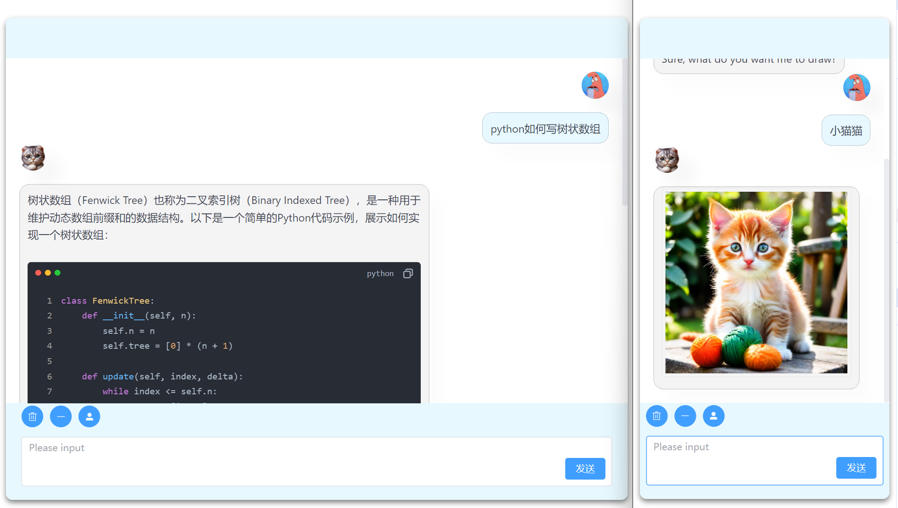

# ChatGPT-Fast-Web

> 本地部署你的私人 ChatGPT 网页应用，支持 GPT3, GPT4 模型。
> 无需服务端后端，轻量化，快速响应



## 功能

- 多模型选择（GPT3, GPT4）
- 极快的响应速度，支持流式响应
- 支持Markdowm语法，代码高亮复制等
- 支持上下文联系与删除
- 角色（面具）功能 参考项目：[NextChat](https://github.com/ChatGPTNextWeb/ChatGPT-Next-Web)

## 本地部署

### 填写密钥

```
# src/store/openai.ts文件

# OPENAI_BASE_URL官方地址为 'https://api.openai.com/v1'
OPENAI_BASE_URL: '',
OPENAI_API_KEY: '',
```

### 在项目根目录运行以下命令

```shell
npm install
```

```shell
npm run dev
```

## LICENSE

[MIT](https://opensource.org/license/mit/)
